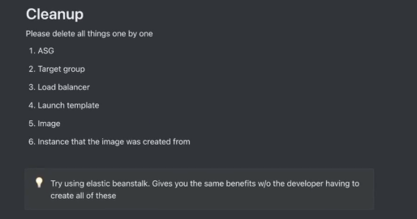

# Scaling Strategies: Vertical vs Horizontal

| **Aspect**                    | **Vertical Scaling (Scaling Up)**                                  | **Horizontal Scaling (Scaling Out)**                                |
|-------------------------------|----------------------------------------------------------------------|---------------------------------------------------------------------|
| **Definition**                | Increasing the capacity of a single server.                        | Adding more servers to handle the load.                            |
| **Implementation Complexity** | Low: Simpler to implement initially.                               | High: Requires changes to application architecture.                |
| **Scalability**               | Limited: Bound by the maximum hardware capacity.                   | Virtually unlimited: Can add more servers as needed.               |
| **Cost Efficiency**           | High costs beyond a certain point.                                 | More cost-effective at scale, uses commodity hardware.             |
| **Downtime for Upgrades**     | Potential downtime required.                                       | No downtime: Instances can be added/removed without affecting availability. |
| **Fault Tolerance**           | Low: Single point of failure.                                      | High: Distributed load reduces the impact of single server failure.|
| **Resource Utilization**      | Limited: One server's resources must handle everything.            | Efficient: Can scale resources based on demand.                    |
| **Load Balancing**            | Not required.                                                      | Required: Needs load balancers to distribute traffic.              |
| **State Management**          | Simple: Single server handles state.                               | Complex: Requires external systems for state management (e.g., Redis).|
| **Performance**               | Dependent on hardware upgrades.                                    | Can handle high traffic by distributing load.                      |
| **Deployment Complexity**     | Low: Single environment is easier to manage.                       | High: Requires orchestration tools like Kubernetes, Docker.        |
| **Management Complexity**     | Low: Easier to manage a single server.                             | High: Involves managing multiple servers and services.             |
| **Monitoring**                | Simplified: Monitoring a single server.                            | Requires comprehensive monitoring across multiple instances.       |
| **Best For**                  | Small to medium-sized applications with predictable growth.        | Large-scale applications with unpredictable or rapid growth.       |
| **Examples of Use**           | - Small web apps. <br> - Early-stage startups.                     | - Large web services (e.g., e-commerce, social media). <br> - Applications with global user base.|
| **Pros**                      | Simpler to implement initially.                                    | Virtually unlimited scalability.                                   |
|                               | No need for load balancing.                                        | Cost-effective at scale.                                          |
|                               | Single environment simplifies management.                          | Fault-tolerant: Reduces single points of failure.                  |
|                               | Lower management complexity.                                       | Efficient resource utilization.                                   |
| **Cons**                      | Limited scalability beyond hardware limits.                        | More complex to implement and manage.                             |
|                               | High costs for hardware upgrades.                                  | Requires load balancers and orchestration tools.                   |
|                               | Potential downtime for upgrades.                                   | Increased deployment and management complexity.                    |
|                               | Single point of failure.                                           | Monitoring across multiple instances can be challenging.           |

## Conclusion
Both vertical and horizontal scaling have their advantages and disadvantages, and the choice between them depends on factors such as the size and growth trajectory of your application. For smaller applications with predictable growth, vertical scaling may be sufficient initially, while larger applications with unpredictable growth may benefit more from horizontal scaling.


## Challenges of Vertical Scaling in Node JS:
- **Single-Threaded Nature**: JavaScript's single-threaded nature restricts its ability to utilize multiple CPU cores concurrently.
- **Comparison with Multi-Threaded Languages**: Unlike languages like Rust, Java, and Go, JavaScript does not have built-in support for multi-threading.
- **Techniques for Parallelism**: Multi-threaded languages utilize threading, pooling, and coroutines to achieve parallelism, which is not directly available in JS.
- **Lack of Native Multi-Threading Support**: The absence of native multi-threading support in JS makes it difficult to parallelize tasks effectively.


## Vertical Scaling Solutions:
Despite these challenges, vertical scaling solutions exist, such as the `cluster` module and child processes.

### The Cluster Module:
The `cluster` module allows running multiple Node.js processes on the same port, enabling horizontal scaling by distributing incoming requests across multiple CPU cores.

### Brief Code Example:
```javascript
const cluster = require('cluster');
const http = require('http');
const numCPUs = require('os').cpus().length;

if (cluster.isMaster) {
  console.log(`Master ${process.pid} is running`);

  // Fork workers for each CPU core
  for (let i = 0; i < numCPUs; i++) {
    cluster.fork();
  }

  // Handle process exit and fork new workers if needed
  cluster.on('exit', (worker, code, signal) => {
    console.log(`Worker ${worker.process.pid} died`);
    // Fork a new worker
    cluster.fork();
  });
} else {
  // Workers can share any TCP connection
  // In this case it is an HTTP server
  http.createServer((req, res) => {
    res.writeHead(200);
    res.end('Hello World\n');
  }).listen(8000);

  console.log(`Worker ${process.pid} started`);
}
```
- **Master Process** : The cluster module creates a master process responsible for creating and managing the worker processes.
- **Worker Process** : The master forks multiple worker processes using the fork() method. Each worker is an independent instance of Node.js, running in a separate and isolated environment with its own event loop.
- **Distributing Requests** : When a client connects to the Node.js server, the master process receives the request and distributes it to one of the available worker processes in a round-robin fashion.


## Capacity Estimation


## Horizontal Scaling

Adding more instances based on a metric to handle larger loads. Every cloud provider has some auto-scaling groups, so does AWS, called ASG.

### Some Buzz Words
- **AMI**: 
  - Snapshot of a machine through which more machines can be created.
  
- **Load Balancer**:
  - An entry point that users send requests to, which forwards it to one of many machines (target group).
  - It is a fully managed service as we don't have to worry about its scaling ever.
  
- **Target Groups (AWS specific)**:
  - A group of EC2 machines that a load balancer can send requests to.
  
- **Launch Template**:
  - A template that can be used to create a saved instance config that can be resued, shared and lauched at a later time.
  - It is different from AMI as it has the 
   AMI .
   security groups (about incoming requests),
   key pair (access to machine), 
   starter code - The scipt that runs when the new instance finally starts.


# Horizontal Scaling with Auto Scaling Groups (ASG) in AWS

## Steps to Configure Horizontal Scaling Using ASG in AWS

1. **Create an EC2 Instance**
   - **Clone the Repository**: Start by cloning your Node.js application repository to the instance.
   - **Install Node.js**: Ensure Node.js is installed on the instance to run your application.

2. **Create an AMI with Your Machine**
   - **Amazon Machine Image (AMI)**: Create an AMI from your configured EC2 instance. This snapshot of your machine can be used to launch multiple instances with the same configuration.

3. **Create a Security Group**
   - **Security Group**: Set up a security group to manage inbound and outbound traffic rules for your instances.

4. **Create a Launch Template**
   - **Add the AMI**: Include the AMI created in step 2.
   - **Add Security Groups**: Specify the security groups to control access to the instances.
   - **Add the Key Pair**: Ensure the correct key pair is added for SSH access.
   - **Write the Starter Code**: Include a user data script to set up the environment and start the application. Example:
     ```bash
     #!/bin/bash
     export PATH=$PATH:/home/ubuntu/.nvm/versions/node/v22.0.0/bin/
     echo "hi there"
     echo "hi there after"
     git pull
     npm install
     cd /home/ubuntu/project
     pm2 start index.js
     pm2 save
     pm2 startup
     ```

5. **Launch the Template**
   - Use the launch template to create instances that will be managed by the ASG.

6. **Configure ASG**
   - **Availability Zones**: Configure the ASG to balance instances across multiple availability zones for high availability.
   - **Load Balancer**: 
     - Add an HTTP (80) listener to the load balancer for your domain.
     - Ensure the load balancer forwards requests to a target group of instances.
   - **Attach the Target Group to the ASG**: The ASG will manage instances and ensure they are part of the target group for load balancing.
   - **Configure Dynamic Scaling Policy**: Set up policies to automatically scale instances based on metrics like CPU utilization.

7. **Check if the Load Balancer Link is Running**
   - Verify that the load balancer URL is accessible and properly distributing traffic to instances.

8. **Request a Certificate from ACM for Secure Connection**
   - **ACM Certificate**: Request a certificate from AWS Certificate Manager (ACM) for your custom domain.
   - **Domain Validation**: Prove ownership of the domain by following the validation steps provided by AWS.
   - **Domain Mapping**: Once validated, map the custom domain to the load balancer domain using your domain provider (e.g., Google Domains).

9. **Hit the Request with the Custom Domain and Check**
   - Access your application using the custom domain to ensure it is properly routed through the load balancer.

10. **Set Up the Min and Max Instances**
    - Define the minimum and maximum number of instances the ASG should manage to handle varying loads.

11. **Go to the Automatic Scaling Tab**
    - **Create a Dynamic Scaling Policy**: 
      - Choose a metric type such as average CPU utilization.
      - Configure the scaling policy to automatically adjust the number of instances based on the chosen metric.

### Clean Up Resources If Not Needed


### Note
All the above steps can be easily done with AWS Elastic Beanstalk.

### Final Flow
Request to Load Balancer on Port 80 ----> Routes all the requests to the Target Group ----> Target Group routes to the application running on Port 3000


## Note: Ad-Hoc Scaling via Node.js (Custom Metric-Based Scaling)

1. **Create a New User with Permissions to AutoScalingFullAccess**
   - Set up an AWS IAM user with the necessary permissions to manage Auto Scaling groups.

2. **Import AWS SDK in Your Node.js Application**

```javascript
const AWS = require('aws-sdk');
AWS.config.update({
  region: 'your-region',
  accessKeyId: 'your-access-key-id',
  secretAccessKey: 'your-secret-access-key'
});

const autoscaling = new AWS.AutoScaling();

const updateDesiredCapacity = (autoScalingGroupName, desiredCapacity) => {
  const params = {
    AutoScalingGroupName: autoScalingGroupName,
    DesiredCapacity: desiredCapacity
  };
  
  autoscaling.setDesiredCapacity(params, (err, data) => {
    if (err) {
      console.error(err, err.stack);
    } else {
      console.log(data);
    }
  });
};

const groupName = 'node-app-1';
const newDesiredCapacity = 4; // Depends upon requirements like number of active users, queue length, requests per second, etc.
updateDesiredCapacity(groupName, newDesiredCapacity);

```